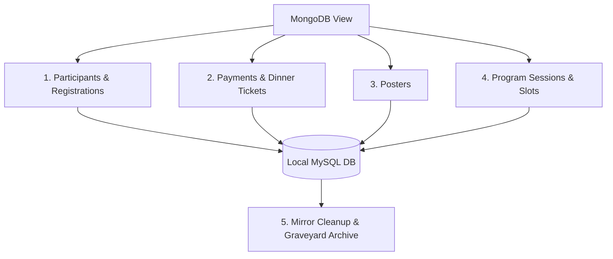

# SCITO & NanoGe Conference Admin Dashboard

*Built in 2026.*

This repository contains the administrative portal and synchronization pipeline for managing conference registrations, payments, schedules, and social dinner tickets for SCITO and NanoGe events.

---

## 🚀 Setup & Execution Guide

To perform a successful synchronization, you must open **three parallel terminal sessions** to establish database tunnels and execute the sync scripts.

### Step 1: Establish SSH Tunnels
Before running the synchronization scripts, start the port-forwarding tunnels to securely access remote databases.

```bash
# Terminal 1: Establish the local MariaDB tunnel
npm run tunnel

# Terminal 2: Establish the MongoDB database tunnel
npm run tunnel-mongo
```

### Step 2: Run Synchronization
Once both tunnels are active and connected, run the appropriate synchronization command in a third terminal:

```bash
# Terminal 3: Run the master synchronization
npm run sync
```

Alternatively, during a live conference, run the sync in **Safe Mode** to avoid any accidental deletions:

```bash
npm run sync:safe
```

---

## ⚙️ Configuration (`.env.local`)

The synchronization script reads configurations from the local environment file. Make sure to define/update these variables before running the sync:

* **`CONFERENCE_ACRONYM`**: The unique abbreviation of the conference (e.g., `HOPV26`, `ANGEL26`).
* **`CONFERENCE_NAME`**: The display name of the conference (e.g., `HOPV 2026`).
* **`CONFERENCE_PLATFORM`**: The source platform, either `NANOGE` or `SCITO`. This determines the target MongoDB and abstract URL logic (defaults to `NANOGE`).
* **`MONGO_URI`**: MongoDB connection string (accessed via port forwarding tunnel).
* **`DB_HOST` / `DB_PORT` / `DB_NAME` / `DB_USER` / `DB_PASSWORD`**: Your local MySQL/MariaDB database credentials.

---

## 🚩 Execution Flags

You can pass execution flags directly to the sync script to isolate which modules are synchronized. This is useful for rapid updates or safe partial syncs.

* `node scripts/sync-all.js --safe`: Skips the Graveyard Cleanup phase (no local deletions).
* `node scripts/sync-all.js --only-participants`: Syncs **only** participants and registrations.
* `node scripts/sync-all.js --only-payments`: Syncs **only** payments and dinner tickets.
* `node scripts/sync-all.js --only-posters`: Syncs **only** posters.
* `node scripts/sync-all.js --only-program`: Syncs **only** program sessions and slots.

---

## 📡 Synchronization Architecture & Modules

The synchronization pipeline updates the local MariaDB database by mirroring selected views/collections from MongoDB, organized into four primary modules:



### 1. Participants & Registrations
* **MongoDB View**: `${CONFERENCE_ACRONYM} - Participants`
* **MySQL Tables**: `participants`, `registrations`, `participant_qr_tokens`
* **Logic**:
  * Syncs/updates participant data (`email`, `firstName`, `lastName`, and `registration_type`) in `participants`.
  * Creates associated conference registrations with `'Registered'` status.
  * Automatically generates a unique 48-character **QR validation token** in `participant_qr_tokens` for checking in at the event if it is missing.

### 2. Payments & Social Dinner Tickets
* **MongoDB View**: `${CONFERENCE_ACRONYM} - Payments`
* **MySQL Tables**: `payments`, `social_dinner_tickets`
* **Logic**:
  * Syncs payment metadata (`amount`, `balance`, `currency`, `status`, `payment_method`, `mongo_id`, `invoice_code`, `client_name`, `client_country_id`, `group_name`, `tickets_info`).
  * Scans purchased items under `tickets_info`. If ticket items named **`'Social Dinner'`** are identified, the pipeline automatically inserts a tokenized ticket in `social_dinner_tickets`.

### 3. Posters
* **MongoDB View**: `${CONFERENCE_ACRONYM} - Posters`
* **MySQL Table**: `posters`
* **Logic**:
  * Syncs or updates poster records matched by `mongo_id`, including titles, abstract codes, authors (JSON array), abstract content, and tables of contents (`toc`).

### 4. Program Sessions & Slots
* **MongoDB View**: `${CONFERENCE_ACRONYM} - Program`
* **MySQL Tables**: `program_sessions`, `program_slots`
* **Logic**:
  * Syncs schedule times into `program_sessions`.
  * Clears out old slots for each session and populates updated `program_slots` (oral presentations, invited speaker slots, presenter names, start/end times).
  * **Admin Setting Preservation**: The local session layout visibility column `is_hidden` is intentionally left unmodified during syncs to preserve administrative choices in the dashboard.

---

## 🧹 Mirror Sync Cleanup & "Graveyard" Protection

To ensure the local database accurately reflects the source database (handling deleted items), the pipeline executes a mirror cleanup phase at the end of each run. 

### How Cleanup Works:
1. Any record currently in the local MySQL database for the active conference that was **not** seen during the latest MongoDB fetch is categorized as **stale**.
2. Stale records are archived in the `sync_graveyard` table with a timestamp, entity type identifier, and their full original JSON payload for recovery purposes.
3. Once archived, the stale records are pruned from active MySQL tables (`registrations`, `payments`, `posters`, `program_sessions`, etc.).

### 🛡️ Core Preservation & Protection Rules:
To prevent synchronization from wiping administrative overrides or manually managed guests, the system enforces the following strict preservation rules:
* **Manual Tickets (`is_manual = 1`)**: Any dinner tickets created manually from the dashboard are protected and **never deleted or archived** during automated cleanup.
* **Guest Registrations (`is_guest = 1`)**: Event guests and organizers added directly in the dashboard are marked as guests and are completely **exempt from automatic cleanup pruning**.

---

## 📝 Reference: Registration Types (CIPIE)

When manually creating participants or importing via CSV for the **CIPIE** conference, you can use the following standard registration types:
- `Staff`
- `Comité Organizador y presidencias ejecutivas`
- `Participantes`
- `Ponente Plenario`
- `Simposio Plenario`
- `Coordinadores/as Área de trabajo`
- `Estudiantes / Jubilados / Desempleados`
- `Simposio/Taller Plenario`
- `Industrial`
- `Streaming`
- `Coordinador de simposio Waved`
- `Ponente Simposio Waved`

*(If left blank during CSV import, it defaults to `"Standard"`)*
